# Marshmallow

**Marshmallow** is a knowledge base management platform for indexing PDF documents and querying them with hybrid semantic + keyword search, backed by a Claude-powered chat interface.

Upload PDFs → index them across two search backends → ask questions in natural language. Marshmallow handles the rest.

---

## Table of Contents

- [Overview](#overview)
- [High-Level Architecture](#high-level-architecture)
- [System Design](#system-design)
  - [Two-Service Architecture](#two-service-architecture)
  - [Data Flow](#data-flow)
  - [Interface-Based Extensibility](#interface-based-extensibility)
- [Indexing Strategy](#indexing-strategy)
  - [Chunking Hierarchy](#chunking-hierarchy)
  - [Embedding](#embedding)
  - [Index Types](#index-types)
- [Search Strategy](#search-strategy)
  - [Hybrid Search](#hybrid-search)
  - [Deduplication & Re-ranking](#deduplication--re-ranking)
  - [Multi-Store Aggregation](#multi-store-aggregation)
- [Chat & Agentic Loop](#chat--agentic-loop)
- [Key Design Decisions](#key-design-decisions)
- [API Reference](#api-reference)
- [Getting Started](#getting-started)
  - [Prerequisites](#prerequisites)
  - [1. Clone & Install](#1-clone--install)
  - [2. Start Redis](#2-start-redis)
  - [3. Configure the Go Service](#3-configure-the-go-service)
  - [4. Set Environment Variables](#4-set-environment-variables)
  - [5. Run the Go Service](#5-run-the-go-service)
  - [6. Run the Python Indexing Worker](#6-run-the-python-indexing-worker)
  - [7. Run the Frontend](#7-run-the-frontend)
- [Usage Examples](#usage-examples)
- [Project Structure](#project-structure)
- [Known Limitations & Future Work](#known-limitations--future-work)

---

## Overview

Marshmallow lets you:

- Create **knowledge bases** that group related documents
- **Upload PDFs** — they are stored in GCS and indexed in the background
- **Search** across all your documents with hybrid (semantic + keyword) queries
- **Chat** with your documents using Claude, which automatically searches relevant knowledge bases using tool use

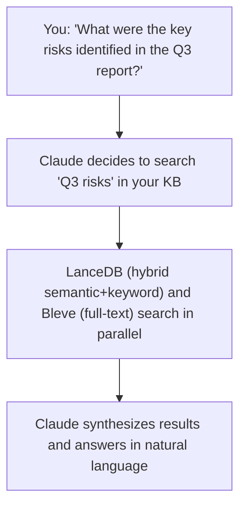

---

## High-Level Architecture

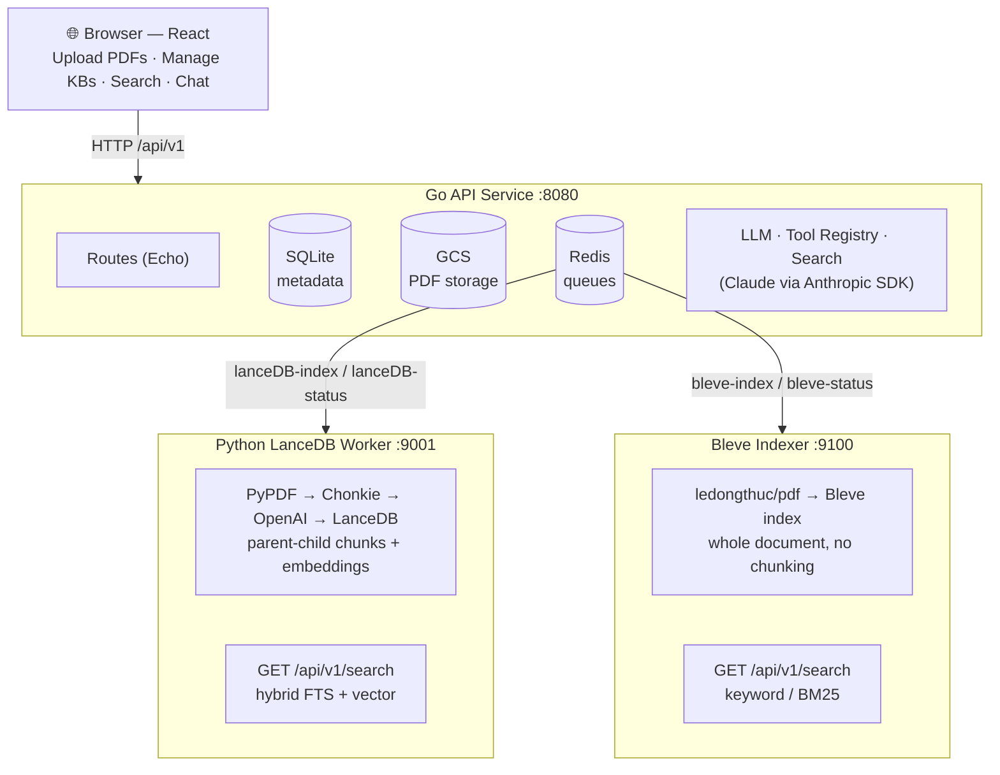

---

## System Design

### Three-Service Architecture

Marshmallow separates concerns across three independently deployable services:

| Service | Language | Port | Role |
|---------|----------|------|------|
| **Knowledge Manager** | Go | 8080 | REST API, metadata management, job dispatch, chat |
| **LanceDB Worker** | Python | 9001 | Semantic + hybrid indexing, embedding generation, vector search |
| **Bleve Indexer** | Go | 9100 | Full-text keyword indexing and BM25 search |

The split exists because:
- Go is well-suited for a low-latency HTTP API, SQLite access, and concurrent queue polling
- Python has the best ecosystem for ML tooling (PyPDF, Chonkie, LanceDB, OpenAI SDK)
- Both indexers are independently deployable — you can run one or both depending on your needs
- Services communicate only via Redis queues and HTTP, keeping them independently scalable

### Data Flow

#### Upload & Indexing

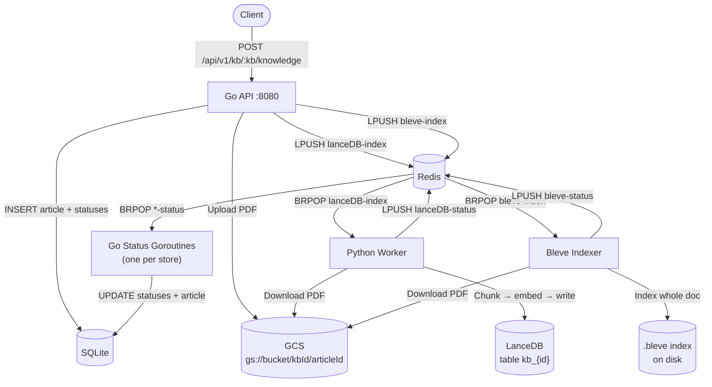

#### Search

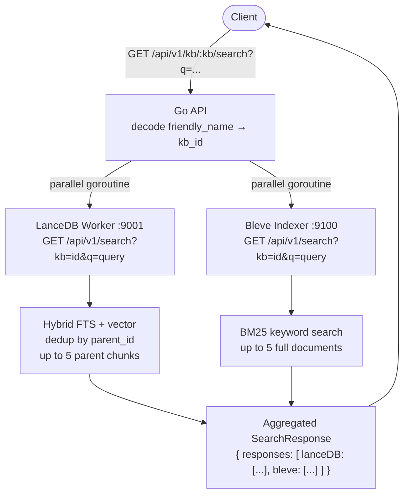

#### Chat

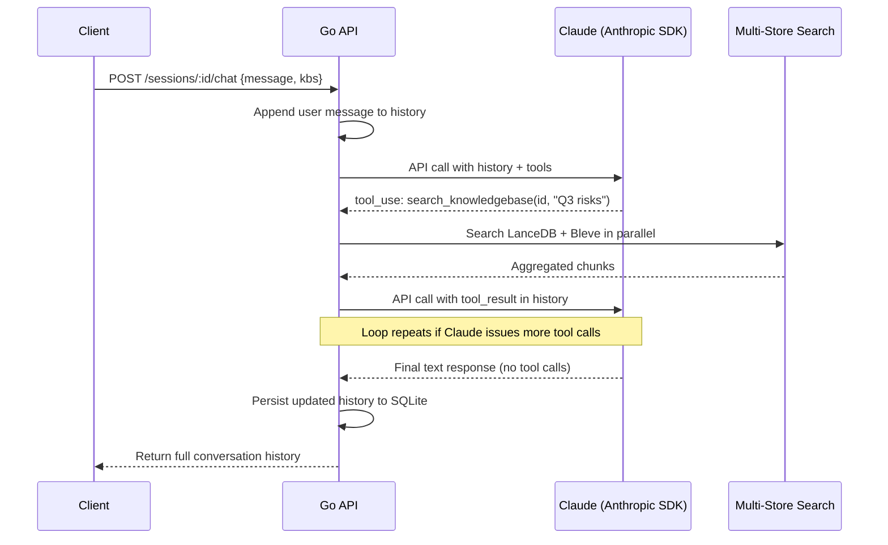

### Interface-Based Extensibility

Three core subsystems are defined as Go interfaces, making it straightforward to swap implementations:

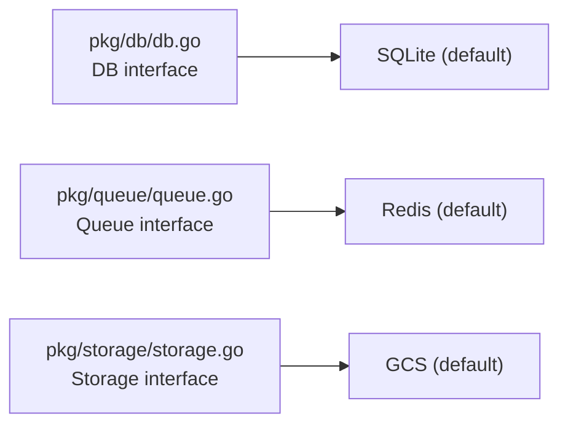

Bleve and LanceDB both implement the same implicit store contract: consume from a Redis indexing queue, publish status updates to a Redis status queue, and expose `GET /api/v1/search?kb={id}&q={query}` returning `string[]`.

To add a new search backend (e.g., Elasticsearch):
1. Build a worker that consumes from a new indexing queue
2. Expose `GET /api/v1/search?kb={id}&q={query}` returning `string[]`
3. Add a `stores` entry to `config.yaml` with an `endPoint`
4. The Go API automatically fans out jobs and aggregates search results — no Go code changes needed

---

## Indexing Strategy

Each uploaded PDF is indexed by **two independent backends** simultaneously. They use fundamentally different approaches, which makes them complementary.

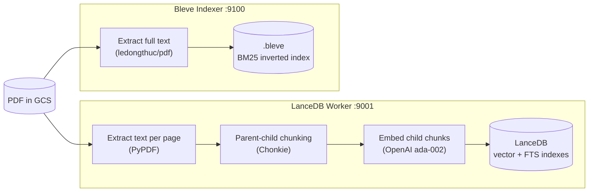

### LanceDB: Parent-Child Chunking

The LanceDB worker uses a **parent-child chunking strategy** (also called "small-to-big retrieval"):

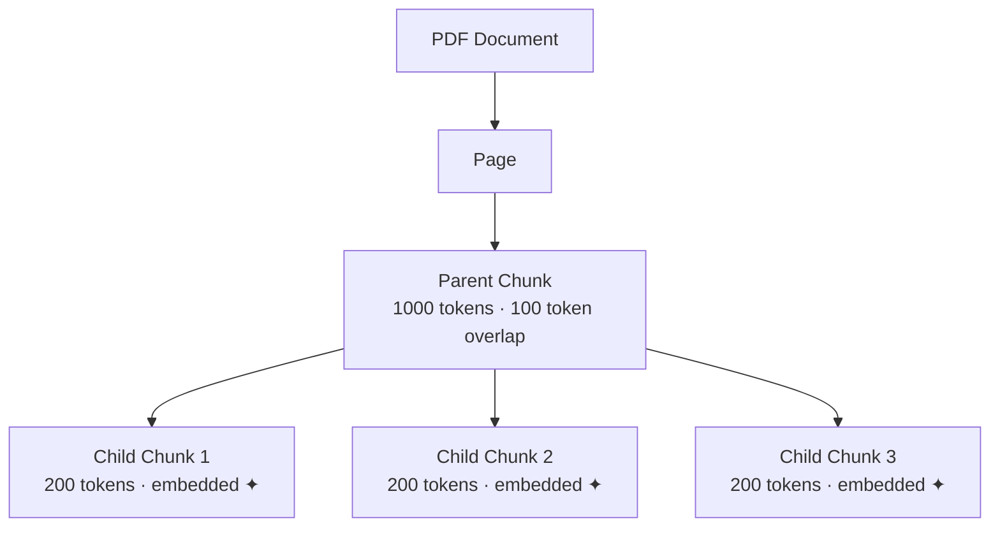

- **Small chunks for retrieval precision**: Embedding 200-token child chunks produces tighter, more specific vectors.
- **Large chunks for response quality**: When a child chunk matches, the full parent chunk (up to 1000 tokens) is returned — giving Claude enough surrounding context.
- **Page boundary awareness**: Chunking resets per page to prevent meaning bleeding across sections.

Each row stored in LanceDB:

| Field | Description |
|-------|-------------|
| `chunk_id` | `{article_id}_{page}_{parent_idx}_{child_idx}` |
| `parent_id` | `{article_id}_{page}_{parent_idx}` |
| `article_id` | Link back to SQLite article |
| `name` | Article name |
| `child_content` | Short text — embedded as vector |
| `parent_content` | Full parent text — returned to caller |
| `content_vector` | 1536-dim OpenAI embedding |

**Embedding**: `text-embedding-ada-002` via LanceDB's `EmbeddingFunctionRegistry` — generated automatically on `table.add()` from the field marked `embeddings.SourceField()`.

**Indexes** (per KB table `kb_{id}`):

| Index | Field | Notes |
|-------|-------|-------|
| FTS | `child_content` | Rebuilt after every indexing job |
| IVF-PQ vector | `content_vector` | Cosine metric, `num_partitions=√(rows)`, `num_sub_vectors=48`. Only created at ≥ 256 rows; brute-force ANN used below that threshold. |

### Bleve: Whole-Document Full-Text Indexing

The Bleve indexer takes a simpler, faster approach — it indexes each PDF as a **single document** with no chunking:

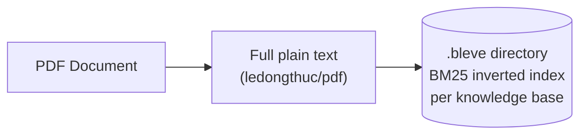

Each Bleve document has three fields:

| Field | Description |
|-------|-------------|
| `id` | Article ID (integer) |
| `name` | Article name |
| `content` | Full plain text of the PDF |

**Index structure**: One `.bleve` directory per knowledge base (`{dataDir}/{kbId}.bleve`), loaded into memory at startup and persisted to disk. Uses Bleve's default `IndexMapping` which applies standard analysis (tokenization, lowercase, stop-word removal).

**Trade-offs vs LanceDB**:

| Aspect | LanceDB | Bleve |
|--------|---------|-------|
| Chunking | Parent-child hierarchy | None — whole document |
| Embeddings | OpenAI text-embedding-ada-002 | None |
| Search type | Hybrid FTS + vector ANN | Keyword BM25 only |
| Semantic understanding | Yes | No |
| Exact term matching | Yes (via FTS component) | Yes |
| Index latency | Higher (embedding API call) | Lower (pure text) |
| Index size on disk | Larger (vectors + FTS) | Smaller (inverted index only) |
| Result granularity | Parent chunk (~1000 tokens) | Full document text |
| Results per query | Up to 5 unique parent chunks | Up to 5 full documents |

---

## Search Strategy

### LanceDB: Hybrid Search

LanceDB combines FTS and vector search in a single query:

```python
table.search(query)
    .query_type("hybrid")           # FTS + ANN vector simultaneously
    .vector_column_name("content_vector")
    .select(["article_id", "parent_id", "parent_content"])
    .limit(20)
```

Hybrid search covers both cases:
- **Semantic queries** ("what are the risks?") — vector search finds conceptually similar passages even without keyword overlap
- **Exact term queries** ("RFC 1918", "CVE-2024-1234") — FTS matches precise terminology that embeddings may not capture well

#### Deduplication

Raw results contain multiple child chunks from the same parent. LanceDB deduplicates by `parent_id` before returning:

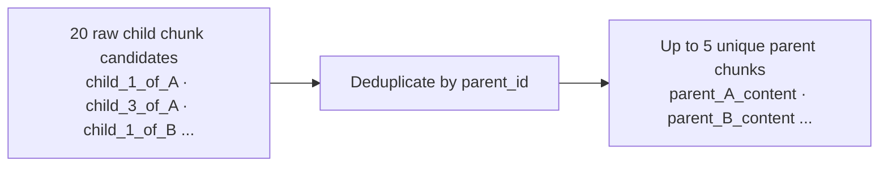

The response is always in terms of **parent chunks** — longer, coherent passages — regardless of which child matched.

### Bleve: Keyword Search

Bleve runs a standard query-string search (Lucene syntax) against its BM25 inverted index:

```go
query := bleve.NewQueryStringQuery(searchString)
searchRequest := bleve.NewSearchRequest(query)
searchRequest.Fields = []string{"content"}
// returns top 5 full-document content strings
```

Bleve supports boolean operators, phrases, and wildcards out of the box. Results are full document text strings (no chunking), up to 5 per query.

**When Bleve results are most useful**: exact product names, document codes, specific identifiers, or any query where keyword precision matters more than semantic similarity.

### Multi-Store Aggregation

The Go API fans the query out to all configured stores in parallel goroutines and merges results:

```json
{
  "responses": [
    {
      "store": "lanceDB",
      "results": ["The deployment consists of three layers...", "Services communicate via gRPC..."]
    },
    {
      "store": "bleve",
      "results": ["Full document text of the architecture overview PDF..."]
    }
  ]
}
```

Failures are isolated per-store — if one store is down, the other's results still return. The frontend groups results by store, letting users see which backend found what.

---

## Chat & Agentic Loop

The chat endpoint implements a **tool-use agentic loop** using the Anthropic SDK:

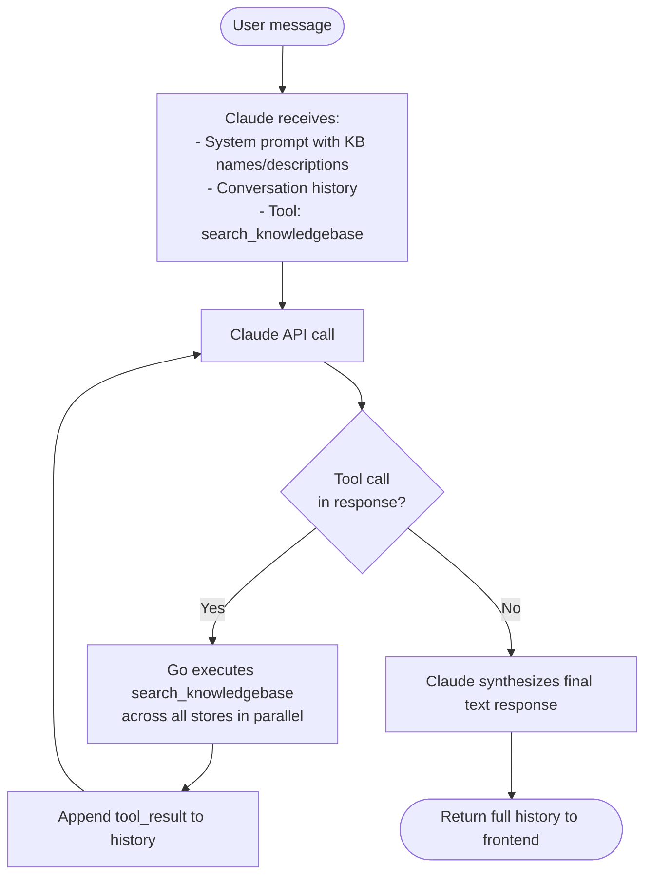

The loop continues until Claude produces a response with no tool calls. This allows Claude to issue multiple searches across different knowledge bases in a single user turn.

Sessions persist conversation history in SQLite as serialized Anthropic `MessageParam` objects, so conversations are resumable across page refreshes.

---

## Key Design Decisions

| Decision | Rationale |
|----------|-----------|
| **Redis queues for job coordination** | Decouples the Go API from the Python worker. Indexing is async — the API returns immediately and workers process at their own pace. Durable queue means jobs survive worker restarts. |
| **GCS for PDF storage** | Both services need access to the same files. A shared object store avoids any file-system coupling between services. |
| **Friendly names for KB IDs** | Human-readable identifiers (e.g., `cozy-hamster`) make API URLs readable. Auto-generated using adjective-noun pairs. |
| **Frontend localStorage as source of truth** | The backend has no list endpoint for KBs — the frontend maintains a local copy of KB metadata. This keeps the backend simple for reads and avoids a round-trip on every page load. |
| **XHR for file uploads** | The Fetch API does not expose upload progress events. XMLHttpRequest's `onprogress` handler lets the UI show per-file upload progress in real time. |
| **Parent-child chunking** | Embedding small chunks improves retrieval precision. Returning parent chunks improves answer quality. This reduces noise while preserving context. |
| **Per-store indexing status** | Documents can be indexed by multiple backends simultaneously. The status table tracks each store independently, allowing partial failures without losing the whole indexing run. |
| **Agentic tool-use loop** | Rather than injecting raw text into the prompt, Claude is given a search tool and decides what to search and when. This reduces prompt stuffing and lets Claude iteratively refine its retrieval. |

---

## API Reference

### Knowledge Bases

| Method | Path | Body / Query | Response |
|--------|------|--------------|----------|
| `POST` | `/api/v1/kb` | `{ name, description }` | `{ knowledgebase: "friendly-name" }` |
| `GET` | `/api/v1/kb` | — | `KnowledgeBase[]` |
| `POST` | `/api/v1/kb/:kb/knowledge` | `{ name, content: "<base64 PDF>" }` | `200 OK` |
| `GET` | `/api/v1/kb/:kb/knowledge/:articleId` | — | `Article` |
| `DELETE` | `/api/v1/kb/:kb/knowledge/:articleId` | — | `204` |
| `GET` | `/api/v1/kb/:kb/search` | `?q=your+query` | `SearchResponse` |

**KnowledgeBase response shape:**
```json
{
  "id": 3,
  "name": "Product Docs",
  "description": "Internal product documentation",
  "friendlyName": "happy-dolphin",
  "articles": [
    {
      "id": 12,
      "name": "architecture-overview.pdf",
      "status": "Completed",
      "articleIndexing": [
        { "name": "lanceDB", "articleId": 12, "status": "Completed", "message": "" }
      ]
    }
  ]
}
```

**SearchResponse shape:**
```json
{
  "responses": [
    {
      "store": "lanceDB",
      "results": ["The deployment architecture consists of...", "Services communicate over..."]
    }
  ]
}
```

### Sessions & Chat

| Method | Path | Body | Response |
|--------|------|------|----------|
| `POST` | `/api/v1/sessions` | `{ model, knowledgeBases: [], history: [] }` | `{ sessionId }` |
| `GET` | `/api/v1/sessions` | — | `Session[]` |
| `GET` | `/api/v1/sessions/:sessionId` | — | `Session` |
| `POST` | `/api/v1/sessions/:sessionId/chat` | `{ message, knowledgeBases: ["kb-name"] }` | `Message[]` |

### Store Search (internal — called by Go API)

Both stores expose the same endpoint signature:

| Store | Base URL | Method | Path | Query | Response |
|-------|----------|--------|------|-------|----------|
| LanceDB worker | `localhost:9001` | `GET` | `/api/v1/search` | `?q=query&kb=kbId` | `string[]` (parent chunks) |
| Bleve indexer | `localhost:9100` | `GET` | `/api/v1/search` | `?q=query&kb=kbId` | `string[]` (full document text) |

---

## Getting Started

### Prerequisites

| Dependency | Version | Notes |
|------------|---------|-------|
| Go | ≥ 1.25.5 | `brew install go` |
| Python | ≥ 3.14 | `brew install python` |
| uv | latest | `curl -LsSf https://astral.sh/uv/install.sh \| sh` |
| Node.js | ≥ 18 | `brew install node` |
| Redis | any | `brew install redis` |
| GCS bucket | — | Requires a GCP project + service account |
| OpenAI API key | — | For text-embedding-ada-002 embeddings |
| Anthropic API key | — | For Claude chat |

### 1. Clone & Install

```bash
git clone https://github.com/your-org/marshmallow.git
cd marshmallow

# Install Python dependencies
uv sync

# Install frontend dependencies
cd frontend && npm install && cd ..
```

### 2. Start Redis

```bash
# macOS (Homebrew)
brew services start redis

# Or run in the foreground
redis-server
```

Verify with: `redis-cli ping` — should return `PONG`.

### 3. Configure the Go Service

```bash
cp samples/config.yaml config.yaml
```

Edit `config.yaml`:

```yaml
queue:
  type: redis
  connectionString: localhost:6379        # Redis address

storage:
  type: gcs
  connectionString: your-gcs-bucket-name  # GCS bucket (must already exist)

stores:
  - name: lanceDB
    indexingQueue: lanceDB-index
    statusQueue: lanceDB-status
    endPoint: "http://localhost:9001/api/v1/search"
  - name: bleve
    indexingQueue: bleve-index
    statusQueue: bleve-status
    endPoint: "http://localhost:9100/api/v1/search"
```

Both stores are optional — you can run only one if preferred, but running both gives you semantic and keyword search in parallel.

**Create the GCS bucket** (if you haven't already):

```bash
gcloud storage buckets create gs://your-marshmallow-bucket --location=us-central1
```

### 4. Set Environment Variables

```bash
# Service account with GCS read/write permissions
export GOOGLE_APPLICATION_CREDENTIALS=/path/to/gcs-service-account.json

# Used by the Python worker to generate embeddings
export OPENAI_API_KEY=sk-...

# Used by the Go service for chat via Claude
export ANTHROPIC_API_KEY=sk-ant-...
```

### 5. Run the Go Service

```bash
make run-km
# which runs: go build -o ./bin/km ./cmd/knowledgemanager/main.go && ./bin/km --config ./config.yaml
```

Expected output:
```
   ____    __
  / __/___/ /  ___
 / _// __/ _ \/ _ \
/___/\__/_//_/\___/ v4.x.x
High performance, minimalist Go web framework
...
⇨ http server started on [::]:8080
```

Test it:
```bash
curl http://localhost:8080/api/v1/kb
# → []
```

### 6. Run the LanceDB Worker

In a second terminal:

```bash
make run-lancedb-service
# which runs: uv run lancedb-service --api_port=9001
```

The worker starts a Redis consumer loop and exposes the search API on port 9001:
```
INFO:     Uvicorn running on http://0.0.0.0:9001
```

Full flag reference:
```bash
uv run lancedb-service \
  --redis_host=localhost \
  --redis_port=6379 \
  --indexing_queue_name=lanceDB-index \
  --results_queue_name=lanceDB-status \
  --bucket_name=your-marshmallow-bucket \
  --api_port=9001
```

### 7. Run the Bleve Indexer

In a third terminal:

```bash
make run-bleve-service
# which runs: go build -o ./bin/bleve ./cmd/stores/bleve/main.go && ./bin/bleve
```

Full flag reference:
```bash
./bin/bleve \
  --redis localhost:6379 \
  --indexing-queue bleve-index \
  --status-queue bleve-status \
  --bucket your-marshmallow-bucket \
  --data-directory ./data/bleve
```

The Bleve service exposes the search API on port 9100 and begins listening for indexing jobs.

### 8. Run the Frontend

In a fourth terminal:

```bash
cd frontend
npm run dev
```

Open [http://localhost:5173](http://localhost:5173). The Vite dev server proxies all `/api` requests to `localhost:8080`.

**All four processes must be running** for the full system to work:

| Process | Port | Terminal |
|---------|------|---------|
| Go API | 8080 | #1 |
| LanceDB worker | 9001 | #2 |
| Bleve indexer | 9100 | #3 |
| Frontend dev server | 5173 | #4 |

---

## Usage Examples

### Create a Knowledge Base

```bash
curl -X POST http://localhost:8080/api/v1/kb \
  -H "Content-Type: application/json" \
  -d '{"name": "Product Docs", "description": "Internal product documentation"}'

# → {"knowledgebase": "happy-dolphin"}
```

### Upload a PDF

```bash
B64=$(base64 -i my-document.pdf)

curl -X POST http://localhost:8080/api/v1/kb/happy-dolphin/knowledge \
  -H "Content-Type: application/json" \
  -d "{\"name\": \"Architecture Overview\", \"content\": \"$B64\"}"
```

The document is now uploaded to GCS and indexing jobs have been dispatched to both the LanceDB worker and the Bleve indexer. Watch both worker terminals to see progress.

### Check Indexing Status

```bash
curl http://localhost:8080/api/v1/kb | jq '.[].articles[] | {name, status, stores: .articleIndexing}'
```

An article cycles through these states (tracked independently per store):

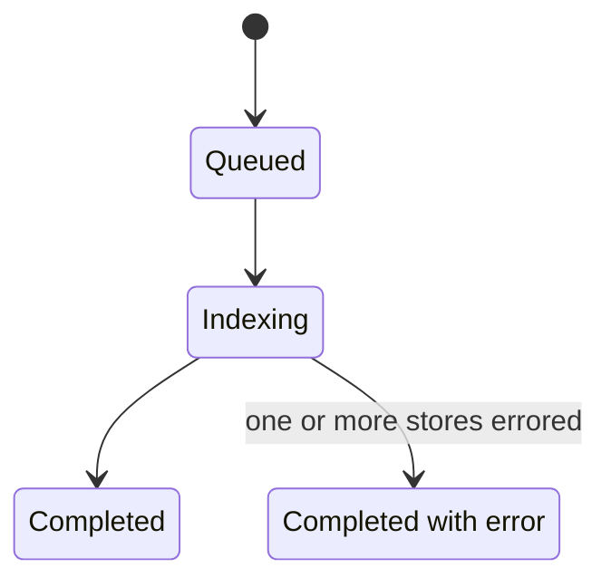

### Search a Knowledge Base

```bash
curl "http://localhost:8080/api/v1/kb/happy-dolphin/search?q=deployment+architecture" | jq .
```

```json
{
  "responses": [
    {
      "store": "lanceDB",
      "results": [
        "The deployment architecture consists of three layers: ingestion, processing, and serving...",
        "Services communicate over internal VPC using gRPC for synchronous calls..."
      ]
    },
    {
      "store": "bleve",
      "results": [
        "Full text of architecture-overview.pdf: The deployment architecture consists of..."
      ]
    }
  ]
}
```

### Chat with Your Documents

```bash
# 1. Create a session
SESSION=$(curl -s -X POST http://localhost:8080/api/v1/sessions \
  -H "Content-Type: application/json" \
  -d '{"model": "claude-sonnet-4-6", "knowledgeBases": [], "history": []}' \
  | jq -r '.sessionId')

# 2. Ask a question referencing your KB
curl -s -X POST "http://localhost:8080/api/v1/sessions/$SESSION/chat" \
  -H "Content-Type: application/json" \
  -d '{"message": "What does the architecture overview say about communication between services?", "knowledgeBases": ["happy-dolphin"]}' \
  | jq '.[] | select(.role=="assistant") | .content[-1].text'
```

Claude will automatically search `happy-dolphin`, retrieve relevant chunks, and synthesize a response.

---

## Project Structure

```
marshmallow/
├── cmd/
│   ├── knowledgemanager/
│   │   └── main.go              # Go API service entry point
│   └── stores/
│       └── bleve/
│           └── main.go          # Bleve indexer entry point (Redis consumer + HTTP search API)
├── pkg/
│   ├── bleve/
│   │   ├── bleve.go             # Index manager: create/load indexes, index documents, search
│   │   └── article.go           # Bleve document schema (id, name, content)
│   ├── config/                  # YAML config parsing
│   ├── db/                      # DB interface + SQLite implementation
│   ├── llm/                     # Claude chat, tool registry, system prompt
│   ├── models/                  # Shared Go structs (KB, Article, Session, IndexingRequest)
│   ├── queue/                   # Queue interface + Redis implementation
│   ├── routes/                  # Echo HTTP route handlers (one file per endpoint)
│   ├── search/                  # Parallel multi-store search aggregation
│   ├── storage/                 # Storage interface + GCS implementation
│   └── utils/                   # Friendly name generator, PDF text extraction (shared by both indexers)
├── lancedb_service/
│   ├── main.py                  # Python worker: chunking + embedding + LanceDB + FastAPI search
│   └── redis.py                 # Redis client wrapper
├── frontend/
│   └── src/
│       ├── App.tsx              # View router (knowledge / kb-detail / chat)
│       ├── components/          # React UI components
│       │   ├── ChatPanel.tsx    # Chat interface with session sidebar
│       │   ├── KBList.tsx       # Knowledge base grid
│       │   ├── KBDetail.tsx     # Documents + search tabs
│       │   ├── MentionInput.tsx # @mention KB selector in chat
│       │   ├── SearchPanel.tsx  # Search UI (groups results by store)
│       │   └── ...
│       ├── hooks/
│       │   └── useFileUpload.ts # Upload queue + state machine
│       ├── lib/
│       │   ├── api.ts           # Fetch/XHR API client
│       │   └── storage.ts       # localStorage persistence layer
│       └── types/index.ts       # TypeScript type definitions
├── samples/
│   └── config.yaml              # Reference configuration (includes both lanceDB + bleve stores)
├── Makefile                     # Build + run targets
├── go.mod                       # Go module dependencies
└── pyproject.toml               # Python project + dependencies (managed by uv)
```

---

## Known Limitations & Future Work

| Area | Current State | Notes |
|------|---------------|-------|
| Article deletion | Stub endpoint — no-op | Needs GCS deletion + LanceDB row removal + Bleve document removal |
| Article detail | Stub endpoint | Should return full article + per-store status |
| Authentication | None | No API key or OAuth middleware |
| Frontend KB sync | localStorage only | Backend has no KB list endpoint; adding one would enable full sync |
| Indexing progress | Simulated in frontend (4–12 s) | The upload endpoint doesn't return an article ID to poll; a status endpoint would fix this |
| Test coverage | Manual test script only | No unit or integration test suites |
| Vector index minimum | Requires ≥ 256 rows | Small KBs fall back to brute-force ANN search automatically |
| Re-indexing | Not supported | No version field or re-index trigger |
